# Agent OS Command Workflow

This diagram shows when and how to use each Agent OS command in your development workflow.

```mermaid
graph TD
    Start([Starting New Project or<br/>Analyzing Existing One]) --> HasAgentOS{Agent OS<br/>Already Setup?}

    HasAgentOS -->|No - New Project| PlanProduct[plan-product.md<br/>Setup new project]
    HasAgentOS -->|No - Existing Project| AnalyzeProduct[analyze-product.md<br/>Install Agent OS]
    HasAgentOS -->|Yes| CheckRoadmap{Need to Add<br/>Roadmap Item?}

    PlanProduct --> SetupComplete[Agent OS Setup Complete]
    AnalyzeProduct --> SetupComplete
    SetupComplete --> CheckRoadmap

    CheckRoadmap -->|Yes| AddRoadmapItem[add-roadmap-item.md<br/>Add new roadmap item]
    CheckRoadmap -->|No| ReadyToDevelop{Ready to<br/>Develop Feature?}
    AddRoadmapItem --> ReadyToDevelop

    ReadyToDevelop -->|Yes| ChooseSpec{Which Feature<br/>to Spec?}
    ReadyToDevelop -->|No| WaitForDev[Wait Until Ready<br/>to Develop]
    WaitForDev --> ReadyToDevelop

    ChooseSpec -->|Specific Feature| CreateSpecSingle["create-spec.md {spec-path}<br/>Single roadmap item"]
    ChooseSpec -->|All Open Items| CreateSpecAll["create-spec.md {all}<br/>All uncompleted items"]
    ChooseSpec -->|Custom Idea| CreateSpecCustom[create-spec.md<br/>Custom specification]

    CreateSpecSingle --> SpecCreated[Spec Created]
    CreateSpecAll --> SpecCreated
    CreateSpecCustom --> SpecCreated

    SpecCreated --> NeedSpecEdit{Need to Edit<br/>Spec?}

    NeedSpecEdit -->|Yes| EditSpec["edit-spec.md {spec-path}<br/>Edit existing spec"]
    NeedSpecEdit -->|No| ReadyForTasks{Ready to Create<br/>Task List?}

    EditSpec --> SpecUpdated[Spec Updated]
    SpecUpdated --> ReadyForTasks

    ReadyForTasks -->|Yes| CreateTasks[create-tasks.md<br/>Generate task list]
    ReadyForTasks -->|No| WaitForTasks[Wait Until Ready<br/>for Task Planning]
    WaitForTasks --> ReadyForTasks

    CreateTasks --> TasksCreated[Tasks Created]
    TasksCreated --> ReadyToImplement{"Ready to<br/>Implement?"}

    ReadyToImplement -->|Yes| ExecuteTasks["execute-tasks.md {spec-path} {all, first 2}<br/>Run implementation"]
    ReadyToImplement -->|No| WaitForImplement[Wait Until Ready<br/>to Implement]
    WaitForImplement --> ReadyToImplement

    ExecuteTasks --> Implementation[Implementation<br/>in Progress]
    Implementation --> ImplementationDone{"Implementation<br/>Complete?"}

    ImplementationDone -->|No| ContinueImplement[Continue with<br/>execute-tasks.md]
    ContinueImplement --> Implementation
    ImplementationDone -->|Yes| HasErrors{"Implementation had<br/>errors or learnings?"}

    HasErrors -->|Yes| UpdateBestPractices["update-best-practices.md<br/>Document learnings & fixes"]
    HasErrors -->|No| FeatureComplete[Feature Complete!]

    UpdateBestPractices --> FeatureComplete
    FeatureComplete --> CheckNext{"More Features<br/>to Develop?"}

    CheckNext -->|Yes| CheckRoadmap
    CheckNext -->|No| ProjectComplete[Project Phase Complete!]

    %% Styling
    classDef commandNode fill:#e1f5fe,stroke:#01579b,stroke-width:2px
    classDef decisionNode fill:#fff3e0,stroke:#e65100,stroke-width:2px
    classDef statusNode fill:#e8f5e8,stroke:#2e7d32,stroke-width:2px
    classDef startEndNode fill:#fce4ec,stroke:#c2185b,stroke-width:2px

    class PlanProduct,AnalyzeProduct,AddRoadmapItem,CreateSpecSingle,CreateSpecAll,CreateSpecCustom,EditSpec,CreateTasks,ExecuteTasks,UpdateBestPractices commandNode
    class HasAgentOS,CheckRoadmap,ReadyToDevelop,ChooseSpec,NeedSpecEdit,ReadyForTasks,ReadyToImplement,ImplementationDone,HasErrors,CheckNext decisionNode
    class SetupComplete,SpecCreated,SpecUpdated,TasksCreated,Implementation,FeatureComplete,ProjectComplete statusNode
    class Start,WaitForDev,WaitForTasks,WaitForImplement,ContinueImplement startEndNode
```

## Command Reference

### Setup Commands

- **`plan-product.md`** - Set up Agent OS for a new project
- **`analyze-product.md`** - Install Agent OS into an existing codebase

### Planning Commands

- **`add-roadmap-item.md`** - Add new items to the product roadmap

### Specification Commands

- **`create-spec.md [roadmap-item]`** - Create spec for specific roadmap item
- **`create-spec.md all`** - Create specs for all uncompleted roadmap items
- **`create-spec.md`** - Create spec for custom idea
- **`edit-spec.md [spec-path]`** - Edit and refine existing specifications

### Implementation Commands

- **`create-tasks.md`** - Generate task list from specification
- **`execute-tasks.md`** - Execute implementation tasks

### Maintenance Commands

- **`update-best-practices.md`** - Update team best practices when errors/issues occurred during implementation

## Typical Workflows

### New Project

1. `plan-product.md` - Set up Agent OS
2. `create-spec.md [feature]` - Create first feature spec
3. `create-tasks.md` - Generate task list
4. `execute-tasks.md` - Implement feature

### Existing Project

1. `analyze-product.md` - Install Agent OS
2. `add-roadmap-item.md` - Add new features to roadmap
3. `create-spec.md all` - Create specs for all planned features
4. Continue with task creation and implementation

### Feature Development Cycle

1. `create-spec.md [feature]` - Create specification
2. `edit-spec.md [spec-path]` - Refine if needed
3. `create-tasks.md` - Break down into tasks
4. `execute-tasks.md` - Implement
5. `update-best-practices.md` - Document learnings (only if errors/issues occurred)
