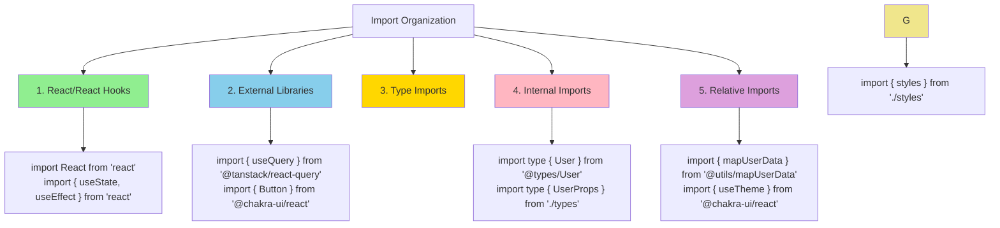

# Agent OS Code Style

## Context and Usage

This document defines **mandatory code formatting and style rules** enforced by ESLint/Prettier for React TypeScript projects. All code must comply with these standards before commit.

### Application Priority

1. **ENFORCED**: ESLint/Prettier automatically format code
2. **MANDATORY**: All rules must be followed without exception
3. **QUALITY GATES**: Code must pass linting, type checking, and formatting

### When to Reference Sub-standards

- **TypeScript/JavaScript patterns**: Reference `code-style/typescript-patterns.md`
- **React TSX structure**: Reference `code-style/tsx-patterns.md`

## Core Formatting

### Indentation & Structure

- **MUST** use 2 spaces for indentation (never tabs)
- **MUST** maintain consistent indentation throughout files
- **MUST** align nested TSX structures for readability

### String & Quote Formatting

- **MUST** use single quotes for strings: `'Hello World'`
- **MUST** use template literals for interpolation: `\`Hello \${name}\``
- **MUST** consistent quote usage enforced by Prettier

### Comments (REQUIRED)

- **MUST** add brief comments above non-obvious business logic
- **MUST** document complex algorithms or calculations
- **MUST** explain the "why" behind implementation choices
- **MUST** update comments when modifying code
- **MUST** keep comments concise and relevant

## File Extensions & TypeScript

### Extension Rules (ENFORCED)

- **MUST** use `.ts` for TypeScript files
- **MUST** use `.tsx` for TypeScript React components
- **MUST NOT** use `.js` or `.jsx` extensions (ESLint enforced)

## Naming Conventions

### Variables & Functions (MANDATORY)

```typescript
// ✅ REQUIRED
const userName = 'john';
const useFetchData = () => {};
const MAX_RETRY_COUNT = 3;

// ❌ FORBIDDEN
const UserName = 'john';
const UseFetchData = () => {};
```

### Components & Types (MANDATORY)

```typescript
// ✅ REQUIRED
type UserProps = { name: string };
const UserProfile = ({ name }: UserProps) => {};
const MyComponent = ({
  UserProfileComponent,
}: {
  UserProfileComponent: React.Component;
}) => {};

// ❌ FORBIDDEN
type userProps = { name: string };
const userProfile = ({ name }: UserProps) => {};
```

### Folders & Files (ENFORCED)

```
// ✅ REQUIRED
components/
└── user-profile/
    ├── index.ts
    ├── UserProfile.tsx
    └── UserProfile.test.tsx

utils/
└── mapUserData.ts

// ❌ FORBIDDEN
components/
├── UserProfile.tsx
└── UserProfile.test.tsx

utils/
└── map_user_data.ts
```

## Function Declarations (MANDATORY)

### Arrow Functions Only

```typescript
// ✅ REQUIRED
const calculateTotal = (items: Item[]) => {
  return items.reduce((sum, item) => sum + item.price, 0);
};

const UserComponent = () => <Text>Hello</Text>;

// ❌ FORBIDDEN
function calculateTotal(items: Item[]) {
  return items.reduce((sum, item) => sum + item.price, 0);
}

class UserComponent extends React.Component {
  render() {
    return <Text>Hello</Text>;
  }
}
```

## Import/Export Rules (ENFORCED)

### Import Organization (MANDATORY ORDER)



### Export Rules (MANDATORY)

```typescript
// ✅ REQUIRED - Named exports only
export const UserProfile = ({ user }: UserProps) => {};
export type { UserProps } from './types';

// ❌ FORBIDDEN - Default exports
export default UserProfile; // Never use
```

## Variable Declarations (ENFORCED)

### Declaration Keywords

```typescript
// ✅ REQUIRED
const config = { api: 'https://api.example.com' }; // Immutable
let count = 0; // Mutable
const userId = '123'; // Min 3 chars (exceptions: id, z, _)

// ❌ FORBIDDEN
var config = { api: 'https://api.example.com' }; // Never use var
const p = { id: '123' }; // Too short variable names
```

## React TSX Standards

### Component Structure (MANDATORY)

```typescript
// ✅ REQUIRED - Proper structure
import React from 'react';
import { Box, Button, Card, CardBody, CardHeader, Heading } from '@chakra-ui/react';

import type { ComponentProps } from './types';

export const ExampleComponent = ({
  title,
  onClick,
  variant = 'solid'
}: ComponentProps) => {
  return (
    <Card>
      <CardHeader>
        <Heading size="md">
          {title}
        </Heading>
      </CardHeader>
      <CardBody>
        <Button
          variant={variant}
          onClick={onClick}>
          Click Me
        </Button>
      </CardBody>
    </Card>
  );
};
```

### Prop Formatting Rules

- **MUST** place each prop on its own line when multiple props exist
- **MUST** align props vertically
- **MUST** keep closing `>` on same line as last prop
- **MUST** use explicit boolean props: `enabled={true}` not just `enabled`
- **MUST** use Chakra UI's conditional styling: `bg={isActive ? 'blue.500' : 'gray.200'}`

### Browser Environment Handling

```typescript
// Browser-specific code
import { useColorMode } from '@chakra-ui/react';

const getPreferredTheme = () => {
  if (typeof window !== 'undefined') {
    return window.matchMedia('(prefers-color-scheme: dark)').matches 
      ? 'dark' 
      : 'light';
  }
  return 'light';
};

const Component = () => {
  const { colorMode } = useColorMode();
  
  return (
    <Box 
      bg={colorMode === 'dark' ? 'gray.800' : 'white'}
      color={colorMode === 'dark' ? 'white' : 'gray.800'}
      shadow="md" 
      borderRadius="lg" 
      p={4}>
      Content
    </Box>
  );
};
```

## Chakra UI Styling Standards

### Styling Hierarchy (MANDATORY)

1. **FIRST**: Use Chakra UI components with built-in variants
2. **SECOND**: Use Chakra UI's style props (bg, p, m, etc.)
3. **THIRD**: Use Chakra UI's theme tokens and design system
4. **FORBIDDEN**: Inline styles or hardcoded CSS values

```typescript
// ✅ REQUIRED - Chakra UI styling
import { Box, Button, Card, CardBody } from '@chakra-ui/react';

const Component = ({ 
  variant = 'solid', 
  isActive 
}: ComponentProps) => {
  return (
    <Card 
      bg="white" 
      borderColor="gray.200"
      borderWidth={isActive ? 2 : 1}
      borderStyle={isActive ? 'solid' : 'solid'}
      borderColor={isActive ? 'blue.500' : 'gray.200'}>
      <CardBody p={6}>
        <Button 
          variant={variant}
          width="full">
          Click Me
        </Button>
      </CardBody>
    </Card>
  );
};

// ❌ FORBIDDEN - Inline styles
const Component = () => (
  <div style={{ backgroundColor: '#F5F5F5', padding: 16 }}>
    Content
  </div>
);
```

## File Organization (MANDATORY)

### Component File Structure

```typescript
// components/user-profile/types.ts
export type UserProfileProps = {
  user: User;
  onEdit: () => void;
};

// components/user-profile/UserProfile.tsx
import type { UserProfileProps } from './types';
export const UserProfile = ({ user, onEdit }: UserProfileProps) => {};

// components/user-profile/index.ts
export { UserProfile } from './UserProfile';
export type { UserProfileProps } from './types';
```

## Prettier Configuration (AUTO-ENFORCED)

- **2 spaces** indentation (no tabs)
- **Single quotes** for strings
- **Trailing commas** for ES5 compatibility
- **80 character** line width
- **Bracket spacing** enabled
- **Semicolons** disabled

## Domain-Specific Standards

### JavaScript/TypeScript Patterns

**Reference**: `@.agent-os/standards/code-style/typescript-patterns.md` - TypeScript patterns, async/await, error handling, and performance optimization

### React TSX Structure

**Reference**: `@.agent-os/standards/code-style/tsx-patterns.md` - TSX formatting, component structure, prop handling, and React specific patterns

## Anti-Patterns (FORBIDDEN)

### ❌ Extension Violations

```typescript
// NEVER use JS extensions in TS project
import { util } from './util.js';

// NEVER mix function styles
function helper() {} // Use arrow functions
const helper = function () {}; // Use arrow functions
```

### ❌ Import/Export Violations

```typescript
// NEVER use default exports
export default Component; // Use named exports

// NEVER mix import styles
import Component, { helper } from './file'; // Use named only

// NEVER skip type imports
import { UserProps } from './types'; // Use: import type { UserProps }
```

### ❌ Variable Declaration Violations

```typescript
// NEVER use var
var data = {}; // Use const/let

// NEVER use short names (exceptions: id, z, _)
const u = user; // Use descriptive names
const p = props; // Use descriptive names

// NEVER use function declarations
function calculate() {} // Use arrow functions
```

## Quality Gates and Integration

### Mandatory Checks (ENFORCED)

- **ESLint**: All rules must pass (no warnings allowed)
- **TypeScript**: Strict mode compilation must succeed
- **Prettier**: Auto-formatting must be applied
- **Husky**: Pre-commit hooks enforce all standards

### Development Workflow

```bash
# Auto-fix formatting and linting
pnpm lint --fix
pnpm typecheck

# Pre-commit automatically runs these checks
git commit -m "feat: add component"
```

### Tech Stack Integration

**Reference**: `@.agent-os/standards/tech-stack.md` - Complete development toolchain and version requirements
