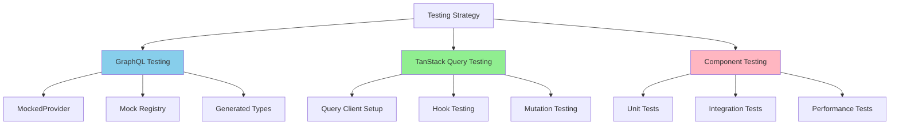

# Testing Patterns

## Testing Strategy Overview



## TanStack Query Testing (MANDATORY)

### Query Client Setup

```typescript
// utils/testUtils.ts
import { QueryClient, QueryClientProvider } from '@tanstack/react-query';

export const createTestQueryClient = () =>
  new QueryClient({
    defaultOptions: {
      queries: { retry: false, gcTime: 0 },
      mutations: { retry: false },
    },
    logger: {
      log: () => {},
      warn: () => {},
      error: () => {},
    },
  });

export const QueryWrapper: React.FC<{ children: React.ReactNode }> = ({ children }) => {
  const queryClient = createTestQueryClient();
  return (
    <QueryClientProvider client={queryClient}>
      {children}
    </QueryClientProvider>
  );
};

export const renderWithQuery = (ui: React.ReactElement, options?: RenderOptions) => {
  return render(ui, { wrapper: QueryWrapper, ...options });
};
```

### Hook Testing

```typescript
// operations/plan/queries/usePlanQuery.test.ts
import { renderHook, waitFor } from '@testing-library/react-native';

// Mock fetchRepository
jest.mock('@libs/query/client', () => ({
  fetchRepository: jest.fn(),
}));

const mockFetchRepository = require('@libs/query/client').fetchRepository;

describe('usePlanQuery', () => {
  beforeEach(() => {
    jest.clearAllMocks();
  });

  it('should return plan data when available', async () => {
    const mockPlanData = {
      currentPlan: { id: 'plan-123', type: 'MEALKIT' },
      selection: { config: { minMealsSize: 2 } },
    };

    mockFetchRepository.mockResolvedValue(mockPlanData);

    const { result } = renderHook(() => usePlanQuery(), {
      wrapper: QueryWrapper,
    });

    expect(result.current.isLoading).toBe(true);

    await waitFor(() => {
      expect(result.current.isLoading).toBe(false);
      expect(result.current.data).toEqual(mockPlanData);
    });
  });

  it('should handle fetch errors', async () => {
    const mockError = new Error('Failed to fetch plan');
    mockFetchRepository.mockRejectedValue(mockError);

    const { result } = renderHook(() => usePlanQuery(), {
      wrapper: QueryWrapper,
    });

    await waitFor(() => {
      expect(result.current.isError).toBe(true);
      expect(result.current.error).toEqual(mockError);
    });
  });
});
```

## Best Practices (MANDATORY)

### ✅ REQUIRED

- **MUST** create isolated query clients for each test
- **MUST** mock at hook level for component tests
- **MUST** test loading and error states
- **MUST** use parametric mock factories

### ❌ FORBIDDEN

- **NEVER** share query clients across tests
- **NEVER** skip error testing
- **NEVER** make real API calls in tests
- **NEVER** ignore async behavior - always use waitFor

## Anti-Patterns (FORBIDDEN)

### ❌ Shared Test State

```typescript
// NEVER share query client across tests
const globalQueryClient = new QueryClient();

describe('Multiple tests', () => {
  it('test 1', () => {
    // Modifies global client - test pollution
  });
});
```

### ❌ Not Testing Async Behavior

```typescript
// NEVER ignore async operations
it('should display data', () => {
  render(<Component />);
  expect(screen.getByText('Data loaded')).toBeTruthy(); // Will fail
});
```
